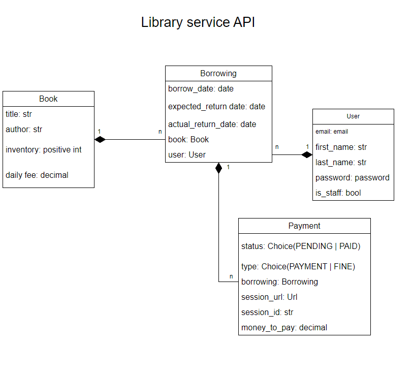

# 📚 Library Service API

A RESTful API for managing a library — books, borrowings, payments, and notifications. Built with Django REST Framework, Celery, Stripe, and Telegram Bot integration.

---

## 🏁 Getting Started

### Prerequisites

Make sure you have the following installed:

- [Docker](https://docs.docker.com/get-docker/) and [Docker Compose](https://docs.docker.com/compose/install/)
- [Git](https://git-scm.com/)
- A [Stripe](https://stripe.com) account (test keys are fine)
- A [Telegram bot token](https://core.telegram.org/bots#botfather) and a chat ID

---

### Step 1 — Clone the repository

```bash
git clone https://github.com/vova-Sh2/library-service-api-.git
cd library-service-api-
```

---

### Step 2 — Create the `.env` file

Create a `.env` file in the project root and fill in all required values:

```env
# Django
DJANGO_SECRET_KEY=your_secret_key
DJANGO_SETTINGS_MODULE=library_service_api.settings.prod

# PostgreSQL
POSTGRES_DB=library_db
POSTGRES_USER=library_user
POSTGRES_PASSWORD=your_password
POSTGRES_HOST=db
POSTGRES_PORT=5432

# Redis / Celery
CELERY_BROKER_URL=redis://redis:6379/0
CELERY_RESULT_BACKEND=redis://redis:6379/0

# Stripe
STRIPE_SECRET_KEY=sk_test_...
STRIPE_PUBLIC_KEY=pk_test_...

# Telegram
TELEGRAM_BOT_TOKEN=your_bot_token
CHAT_ID=your_chat_id
```

> **Tip:** To get a Telegram `CHAT_ID`, send a message to your bot and open:
> `https://api.telegram.org/bot<TOKEN>/getUpdates`

---

### Step 3 — Build and start all services

```bash
docker-compose up --build
```

This command will spin up the following containers:

| Container | Description | Port |
|---|---|---|
| `db` | PostgreSQL database | `5432` |
| `redis` | Redis broker for Celery | `6379` |
| `web` | Django application | `8001` |
| `celery` | Celery worker | — |
| `celery-beat` | Celery Beat scheduler | — |

On first start, the `web` container automatically:
1. Waits for the database to be ready
2. Runs all migrations
3. Loads fixture data (`fixture.json`)
4. Collects static files

---

### Step 4 — Verify the setup

Once all containers are up, open in your browser:

- **API root** → http://localhost:8001/api/books/
- **Swagger UI** → http://localhost:8001/api/doc/swagger/

---

### Step 5 — Create a superuser (optional)

To access the Django admin panel at http://localhost:8001/admin/:

```bash
docker-compose exec web python manage.py createsuperuser
```
---
Or use:
```
Email: admin@library.com
Password: admin123
```

## Getting access

```
create user via:   /api/user/register/
get access token:  /api/user/token/
```

The API uses **JWT tokens**. Include the token in every request:

```
Authorize: Bearer <your_token>
```
## 🗂️ DB Schema


## 🚀 Features

- **Books** — CRUD for the book catalog (title, author, cover type, inventory, daily fee)
- **Borrowings** — borrow and return books with automatic inventory management
- **Payments** — Stripe-based payment sessions for borrowings and overdue fines
- **Notifications** — Telegram bot sends a message on every new borrowing and overdue alert
- **Background tasks** — Celery + Redis for scheduled overdue checks (Celery Beat)
- **Authentication** — JWT via `djangorestframework-simplejwt`
- **API Docs** — auto-generated OpenAPI schema via `drf-spectacular` (`/api/doc/swagger/`)

---

## 🛠 Tech Stack

| Layer | Technology |
|---|---|
| Framework | Django 6.0, Django REST Framework 3.17 |
| Database | PostgreSQL 16 |
| Cache / Broker | Redis 7 |
| Task queue | Celery 5.6 + Celery Beat |
| Payments | Stripe 15 |
| Notifications | Telegram Bot API |
| Auth | JWT (SimpleJWT) |
| API Docs | drf-spectacular |
| Containerization | Docker + Docker Compose |

---

## 📁 Project Structure

```
library-service-api/
├── books/            # Book model, views, serializers
├── borrowings/       # Borrowing model, return action, overdue check
├── payments/         # Stripe payment sessions, Payment model
├── notifications/    # Telegram bot integration
├── user/             # Custom user model, registration, auth
├── library_service_api/
│   ├── settings/     # base / prod settings
│   ├── celery.py     # Celery app config
│   └── urls.py
├── Dockerfile
├── docker-compose.yaml
└── requirements.txt
```

---

## 📖 API Documentation

Full interactive API documentation is available after starting the project:

- **Swagger UI** — http://localhost:8001/api/doc/swagger/


---

## 🧪 Running Tests

```bash
# Inside the web container
docker-compose exec web python manage.py test

# Or with pytest
docker-compose exec web pytest
```

---

## 📬 Notifications

When a borrowing is created, the Telegram bot sends a message to the configured chat with:
- User name and email
- Book title and remaining inventory
- Borrow date and expected return date

Overdue borrowings are also reported via Celery Beat on a scheduled basis.